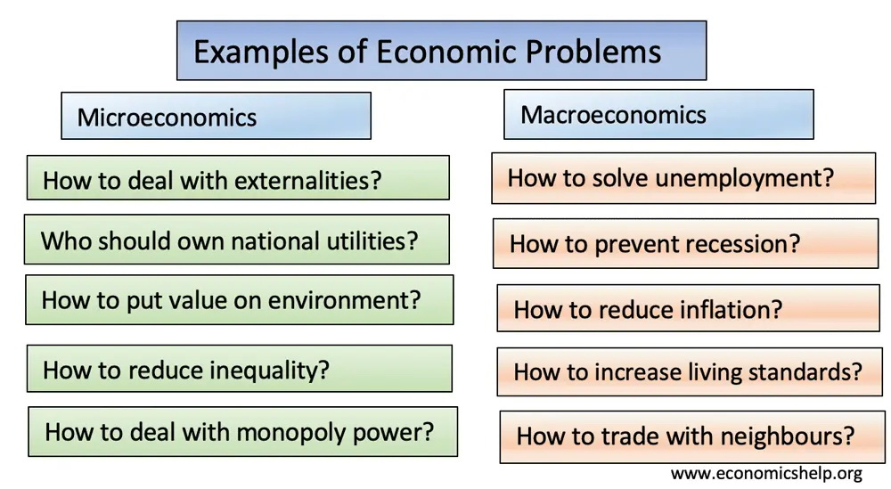
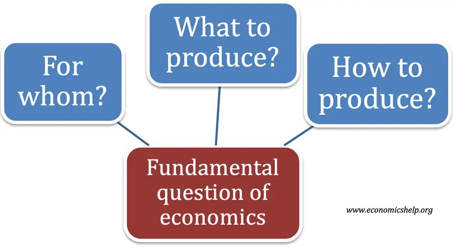
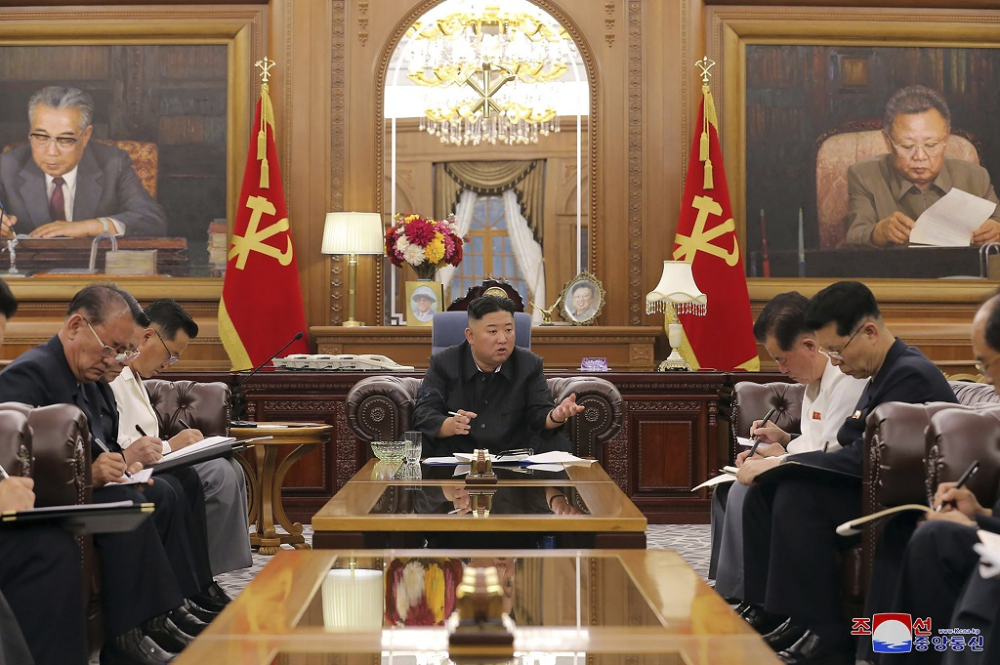

```{r setup, include=FALSE}
options(htmltools.dir.version = FALSE)
knitr::opts_chunk$set(
  fig.width=9, fig.height=3.5, fig.retina=3,
  out.width = "100%",
  cache = FALSE,
  echo = TRUE,
  message = FALSE, 
  warning = FALSE,
  hiline = TRUE
)
```

```{r xaringan-themer, include=FALSE, warning=FALSE}
library(xaringanthemer)
style_duo_accent(
  primary_color = "#1381B0",
  secondary_color = "#FF961C",
  inverse_header_color = "#FFFFFF"
)
```

```{r load_packages, message=FALSE, warning=FALSE, include=FALSE} 
library(fontawesome)
```

```{r xaringan-tile-view, echo=FALSE}
xaringanExtra::use_tile_view()
```

```{r xaringan-scribble, echo=FALSE}
xaringanExtra::use_scribble()
```
layout: true

<div class="my-footer"><span>bangtedy.github.io</span></div>

<!-- this adds the link footer to all slides, depends on my-footer class in css-->

---

# Setelah mempelajari modul ini Anda diharapkan mampu:
- Menjelaskan perihal konsep dasar sistem ekonomi dan mekanisme bekerjanya dalam kegiatan perekonomian suatu negara, khususnya dengan latar belakang kondisi negara seperti Indonesia
---

# Kompetensi setelah mempelajari modul ini:

1. Menjelaskan pengertian dan pendekatan-pendekatan yang sering digunakan dalam mengenali sistem ekonomi suatu negara. 
2. Menjelaskan kedudukan sistem ekonomi dalam kaitannya dengan lingkungan material (alam) dan lingkungan sosial. 
3. Menjelaskan mekanisme bekerjanya sistem ekonomi melalui peranan pelaku-pelaku ekonomi dalam kegiatan ekonomi suatu negara, khususnya Indonesia. 
4. Menjelaskan sifat dan pola hubungan antarpelaku ekonomi yang membentuk struktur ekonomi di suatu negara, khususnya Indonesia. 

---

# Konsepsi Sistem Ekonomi 
## PENGERTIAN SISTEM EKONOMI 
--> KITA MULAI DENGAN PERSOALAN EKONOMI

```{r out.width = '65%', fig.align='center', echo=FALSE}

```
##### [sumber: Economics Help](https://www.economicshelp.org/blog/15276/economics/examples-of-economic-problems/)

---
class: right, down

# TIGA PERTANYAAN EKONOMI

```{r out.width = '75%', fig.align='center', echo=FALSE}

```
##### [sumber: Economics Help](https://https://www.economicshelp.org/blog/glossary/basic-economic-problem/)

---

# APA "INTI" PERSOALAN EKONOMI?
--

## KELANGKAAN SUMBERDAYA VS KEINGINAN YANG TAK TERBATAS
--

## MENGHARUSKAN KITA MEMBUAT PILIHAN

---

# Tiga PERSOALAN "UTAMA" EKONOMI?

1. barang apa yang seharusnya dihasilkan; 

--

2. bagaimana cara menghasilkan barang itu; 

--

3. untuk siapa barang tersebut dihasilkan atau bagaimana barang tersebut didistribusikan kepada masyarakat.

### Jawaban atas ketiga pertanyaan tersebut akan menentukan sistem ekonomi sebuah negara

---

# Jadi Sistem Ekonomi
- Keseluruhan lembaga (pranata) yang hidup dalam suatu masyarakat yang dijadikan acuan oleh masyarakat tersebut dalam mencapai tujuan yang telah ditetapkan. 
- Lembaga (institution) adalah organisasi atau kaidah, baik formal maupun informal yang mengatur perilaku dan tindakan anggota masyarakat tertentu baik dalam melakukan kegiatan rutin sehari-hari maupun dalam mencapai suatu tujuan tertentu. 

---
class: right, down

```{r out.width = '75%', fig.align='center', fig.cap = 'Ekonomi Korea Utara', echo=FALSE}

```
##### [sumber](https://caribbean.loopnews.com/content/state-media-kim-has-plans-stabilise-north-korean-economy)

---
class: right, down

```{r out.width = '75%', fig.align='center', fig.cap = 'Ekonomi Australia', echo=FALSE}

```
##### [sumber](https://newsroom.unsw.edu.au/news/business-law/bad-economic-bet-what-will-climate-change-inaction-cost-australia)

---
# Diskusi
## Anda ingin menanam porang
## Apa yang akan Anda lakukan?
## Apa yang harus Anda lakukan?
## Mengapa demikian?
## Permintaan di LN sangat besar --> Ekspor

---

# Sistem ekonomi dan ideologi negara --> saling terkait

Sistem ekonomi yang dibentuk merupakan rumusan dari ideologi yang telah tertanam secara kuat dalam jangka waktu yang lama dari suatu kumpulan masyarakat atau yang lebih 
luas yaitu suatu bangsa. 

---

# Dua Titik Ekstrim
- Sistem Ekonomi Kapitalis vs. Sistem Ekonomi Sosialis
- Perbedaan mendasar
    + tatanan tentang kepemilikan;
    + tatanan pelaku/partisipan;
    + tatanan tentang proses penyelenggaraan kegiatan ekonomi,
    + tatanan tentang tujuan yang hendak dicapai.

---
# Pendekatan Sistem Ekonomi

### Empat kriteria pendekatan  sistem ekonomi:

1. hasil yang dicapai dalam perekonomian: pertumbuhan, pemerataan, stabilitas 
2. mekanisme pengatur: pasar, tradisi, komando --> kelebihan dan kekurangan? 
3. bentuk hak milik: individu, kolektif, negara 
4. motivasi berekonomi

---
class: middle, center
# Diskusi: Perekonomian Tertutup vs Terbuka

- Indonesia masuk mana?
- Keuntungan dan kerugian
- Bagaimana sebaiknya?

---
## Mekanisme Bekerjanya Sistem Ekonomi

### Pelaku-Pelaku Ekonomi:
- Produsen/pengusaha
- Konsumen
- Lembaga Perbankan dan Keuangan
- Badan Publik dan Pemerintah

### Pola Hubungan Antarpelaku Ekonomi
- Eksploitatif(timpang)
- Emansipatoris(setara)

### Struktur Sosial Ekonomi

- Kelas atas
- Kelas menengah
- Kelas bawah

---

## LATIHAN

1. Apakah tujuan dibentuknya sistem ekonomi? Bagaimanakah proses terbentuknya sistem ekonomi dalam suatu negara? 
2. Berikan gambaran kedudukan manusia dalam proses pembentukan sistem ekonomi? 
3. Jelaskan berbagai pendekatan yang dapat menjadi dasar pembeda sistem ekonomi yang diterapkan di suatu negara? 

---

class: inverse, right, middle


# Find me at...

[`r fa(name = "twitter")` @t_hlb](http://twitter.com/t_hlb)  
[`r fa(name = "blog")` bangtedy.github.io](https://bangtedy.github.io)