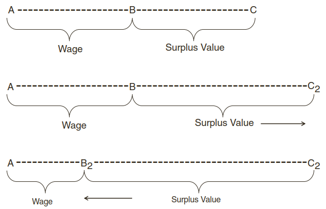

```{r, echo = FALSE}
# google scholar metadata
library(metathis)

if (knitr::is_html_output()) {
  meta() |> 
    meta_google_scholar(
      title = "Sistem Ekonomi Sosialis",
      author = "Tedy Herlambang",
      publication_date = "2021",
      isbn = ""
    ) 
}
```

```{r setup, echo = F}
knitr::opts_chunk$set(
  comment = "#",
  #cache = TRUE,
  collapse = TRUE,
  warning = FALSE,
  message = FALSE,
  fig.width = 7,
  fig.height = 5.25,
  fig.align = 'center',
  fig.retina = 3
)

# base plot layout
mypar = list(mar = c(3,3,0.5,0.5), mgp = c(1.5, 0.3, 0), tck = -.008)

# xaringan Extra
xaringanExtra::use_xaringan_extra(c("tile_view", "animate_css", "tachyons"))
xaringanExtra::use_extra_styles(
  hover_code_line = TRUE,         #<<
  mute_unhighlighted_code = TRUE  #<<
)
xaringanExtra::use_editable(expires = 1)
xaringanExtra::use_panelset()
xaringanExtra::use_scribble()
```
class: middle, title-slide

<!-- top logo (comment to remove or edit on `conf/css/style.css:23`) -->
<div class="lab-logo"></div>
<!-- <div class="uni-logo"></div> -->

# Sistem Ekonomi Sosialis

<hr width="100%" align="left" size="0.3" color="red"></hr>

## <span style="color:red">Sistem Ekonomi Sesi 4</span>

### Tedy Herlambang .small[<br>]

<br><br><br><br><br>
[<i class="fas fa-blog" style="color:#e7e8e2"></i> bangtedy.github.io](https://bangtedy.github.io)

[<i class="fa fa-twitter fa-lg" style="color:#e7e8e2"></i> @t_hlb](https://twitter.com/t_hlb)

---

# <span style="color:#243823">Pendahuluan</i>

Modul ini membahas:
- Pengertian dan konsep dasar sistem ekonomi sosialis-komunis murni dan variasinya
- Filosofi sistem ekonomi sosialis-komunis
- Ciri-ciri sistem ekonomi sosialis-komunis (murni)
- Perkembangan pemikiran dan praktik sistem ekonomi sosialis menjadi sistem ekonomi sosialis pasar (*market socialism*)

---
# <span style="color:#243823">Pendahuluan</i>

Setelah mempelajari modul 4 ini diharapkan Anda mampu menganalisis dan menjelaskan perihal konsep dan praktek sistem ekonomi sosialis-komunis dan sistem ekonomi sosialis-pasar dan perbedaan keduanya. 

Indikator kompetensi yang menunjukkan keberhasilan Anda adalah jika Anda mampu:

1. Menjelaskan pengertian dan konsep dasar sistem ekonomi sosialis-komunis. 
2. Menganalisis ciri-ciri penerapan sistem ekonomi sosialis di dunia. 
3. Menjelaskan praktik-praktik sistem ekonomi sosialis-komunis di negara-negara komunis.
4.  Menjelaskan pengertian dan konsep dasar sistem ekonomi sosialis-pasar dan perbedaannya dengan sistem ekonomi sosialis-komunis (murni).
5. Menjelaskan ciri-ciri sistem ekonomi sosialis-pasar dan praktiknya di negara-negara bekas komunis.

---
class: middle, center, inverse

# KB1: SISTEM EKONOMI SOSIALIS
<hr width="100%" align="left" size="0.3" color="#9bb80d"></hr>

---
# Sejarah Perkembangan Sistem Ekonomi Sosialis

- Antithesa dari sistem ekonomi kapitalis
- Muncul dimasa-masa kegelapan kapitalisme:
  - eksploitasi buruh (terutama anak-anak dan wanita)
  - jam kerja yang sangat panjang, tidak ada waktu istirahat cukup
  - tidak ada perlindungan terhadap buruh
- Upah buruh sangat rendah

---
# Pemikiran Karl Max<sup>1</sup>: 
- In 1848, Marx and Engels wrote one of their most powerful documents, **The Communist Manifesto**. 
- In it, they encouraged workers to rise up against their exploitative employers
  - advocating socialism and communism as alternatives. 


.footnote[1 Geoffrey Schneider 2019]
---
# Pemikiran Karl Max:

- Marx is often thought of as the father of communism, 
  - but he had very little to say about communism and how it might work. 
- He concentrated instead on analysing the functioning of capitalism.
- Marx was able to anticipate many of the characteristics of modern capitalism: 
  - globalization, 
  - the rise of huge corporations, 
  - the influence of money in democratic political systems, 
  - the abiding alienation of wage workers.
- The power of the analytical framework he developed accounts for why many of his ideas still remain relevant today.

---
# Pemikiran Karl Max:
- hubungan, tatanan dan norma feodal tidak lebih dari selubung suci yang menutup-nutupi eksploitasi kelas atas feodal terhadap kelas bawah
  - di balik perasaan sungkan dan hormat masyarakat terhadap penguasa terhadap kebaikannya tersembunyilah kerakusan kelas-kelas atas yang hidup dari pekerjaan rakyat.
  - Nilai-nilai feodal adalah selubung ideologis kenyataan bahwa masyarakat feodal berdasarkan penghisapan manusia atas manusia.
- Eksploitasi dan persaingan membentuk kelas proletarian.

---
# SURPLUS VALUE AND THE EXPLOITATION OF LABOR
- Surplus value: the amount of value produced by workers over and above the cost of their wages (including benefits).
- a firm that is pursuing maximum profits must increase the B—C part of the workday as much as possible (lihat gambar) dengan cara: 
- Increasing the length of the workday (moving C to the right from C to 
C2, lihat gambar) dan,
- Reducing the amount of time necessary to pay for a laborer’s wage 
(moving B to the left from B to B2), dengan cara: 
  - reducing wages, 
  - replacing workers with more cost-effective machinery, or 
  - increasing the productivity of workers by speeding up the pace of work or other measures that target productivity.

---
class: center



---
# KONSEP PEMIKIRAN EKONOMI SOSIALIS
- Darsono (2002:1):
  - Sosialisme adalah suatu ideologi yang mengagungkan kapital milik bersama seluruh masyarakat atau milik negara sebagai alat penggerak kesejahteraan rakyat
- Sosialisme menelanjangi keserakahan kapitalisme
- Pemikir sosialisme belakangan: membebaskan manusia dari belenggu penindasan dan penghisapan tetapi anti dogmatisme (Marxisme tidak boleh dijadikan dogma)

---
# CIRI-CIRI DAN PRAKTIK SISTEM EKONOMI SOSIALIS

.pull-left[
- Negara sangat berkuasa dalam pemilikan bersama faktor produksi
- Produksi dilakukan sesuai dengan kebutuhan

- Perencanaan ekonomi (*economic planning*)
]

.pull-right[
- Semua faktor produksi untuk kepentingan bersama bukan untuk keuntungan pribadi
- Produksi barang dan jasa diatur tidak hanya yang bernilai ekonomi saja
- Mekanisme pasar tidak berlaku, negara yang menentukan semua harga
]
---

# Diskusi: Kelebihan dan Kelemahan Sistem Ekonomi Sosialis

.pull-left[Kelebihan

1.

2.

3.

dst.
]
.pull-right[Kelemahan

1.

2.

3.

dst.
]

---
class: middle, center, inverse

# KB2: SISTEM EKONOMI SOSIALIS-PASAR
<hr width="100%" align="left" size="0.3" color="red"></hr>

---
# Konsep Dasar Ekonomi Sosialis-Pasar
- Muncul sebagai reaksi terhadap inefisiensi sistem ekonomi sosialis yang serba terencana terpusat.

---
# Ekonomi Pasar Sosial di Jerman
- Mencoba menggabungkan apa yang terbaik dari sistem kapitalis dan sosialis
- Kekuatan permintaan dan penawaran didorong oleh konsep moral yang kuat 
---
# Sosialisme Pasar di Tiongkok
- Kontradiksi antara kebutuhan untuk mempertahankan pengawasan dan tekanan-tekanan untuk memperluas mekanisme pasar. 
---
class: inverse

.pull-left1[
<br>

# Terima kasih
<hr width="100%" align="left" size="0.5" color="red"></hr>

<br><br><br><br><br><br><br><br>


]

.pull-right1[
<br>

]
